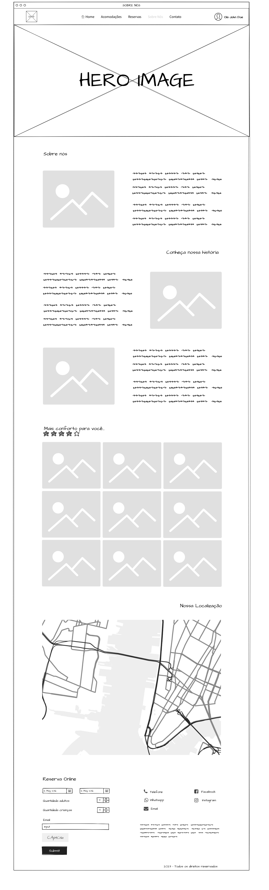

# "Sobre Nós"

Sobre Nós, faz parte do desafio individual proposto pela [T.EX](https://texperts.com.br/), onde o aluno
deve recriar a referida página utilizando conceitos básicos de HTML semântica, CSS com flexbox e grid layout
e aplicando responsividade.

## Principais pontos de aprendizado

- [X] HTML semântico
- [X] Básico CSS
- [X] Flexbox
- [X] Grid layout
- [X] Sass
- [X] Smartphone portrait
- [X] Smartphone landscape
- [X] Tablet portrait
- [X] Tablet landscape

## Wireframe
